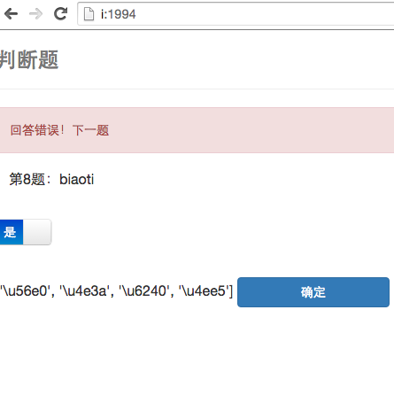

#quiz4guo

> 这个web应用采用的技术:

- flask
- bootstrap
- sqlite
- jQuery & ajax

####核心代码段
```
app.route('/', methods=['GET', 'POST'])
def index():
    tfs = {"xuanze":"xuanzeti.html", "panduan":"panduanti.html", "tiankong":"quiz.html"}
    update_question()
    xuanzetixuanxiang = ''
    if "current_question" not in session:
        session["current_question"] = -1
    if "score" not in session:
        session["score"] = 0
        session["scuccnum"] = 0

    cq = session["current_question"]
    if 0 <= cq < len(questions):
        qtype = questions[cq]["type"]
        #print "qtype", qtype
        if qtype == "xuanze":
            xuanzetilist = questions[cq]["xuanzetilist"]
            xuanzetixuanxiang = repr(list(xuanzetilist))
    if request.method == "POST" and cq < len(questions):
        try:
            if cq == -1:
                entered_answer = request.form.get("answer", '')
            elif qtype == "xuanze":
                entered_answer = json.loads(list(request.form)[0])[0]["id"]
                #print "entered_answer", entered_answer
                #print "xuanzetilist", xuanzetilist
                entered_answer = "ABCD"[xuanzetilist.index(entered_answer)]
                #print "xuanzetixuanxiang, entered_answer", xuanzetixuanxiang, entered_answer
                #print "realan", questions[session["current_question"]]["answer"]
            elif qtype == "panduan":
                entered_answer = list(request.form)[0]
                entered_answer = {"true": "1", "false": "0"}[entered_answer]
                #print entered_answer
            elif qtype == "tiankong":
                entered_answer = request.form.get("answer", '')
        except:
            entered_answer = ""
        #print entered_answer

        if not entered_answer:
            flash(u"请输入一个答案！", "error")
        elif session["current_question"] == -1:
            if yztdaan == entered_answer:
                session["current_question"] = 0
            else:
                flash(u"答案错误！思想觉悟不高，你不是人类吗？", "error")
        elif entered_answer != questions[session["current_question"]]["answer"]:
            session["current_question"] += 1# next
            flash(u"回答错误！下一题", "error")
        else:
            session["current_question"] += 1
            session["score"] += 1
            session["scuccnum"] += 1
            flash(u"恭喜，答对了！下一题", "right")

    cq = session["current_question"]
    if 0 <= cq < len(questions):
        qtype = questions[cq]["type"]
        #print "qtype", qtype
        if qtype == "xuanze":
            xuanzetilist = questions[cq]["xuanzetilist"]
            xuanzetixuanxiang = repr(list(xuanzetilist))
    #print 'cq, lenques', cq, len(questions)
    if cq >= len(questions):
        return render_success( sessionScore=session["score"], failn=len(questions)-session["scuccnum"] )
    #print "Current", questions[cq]["question"] , xuanzetixuanxiang
    tf = tfs[questions[cq]["type"]] if cq != -1 else "quiz.html"
    #print "xuanzetilist", xuanzetixuanxiang
    return render_template(
        tf,
        question=questions[cq]["question"] if cq != -1 else yanzhengti,
        question_number=cq+1 if cq != -1 else -1,
        xuanzetixuanxiang = xuanzetixuanxiang.replace("u'", "'").replace('u"', '"'),
        quesnum=len(questions) if cq != -1 else u"无数"
                          )

```

#####`5种页面` 共制作了5种页面，为选择题，填空题，判断题，结分页（当前这个页面），添加题目页面

- 填空题用的是表单提交
- 选择和判断用的ajax方式

**一个缺陷**  单选题过渡到判断题时 页面重写不干净，出现['\u56e0', '\u4e3a', '\u6240', '\u4ee5']这样的js代码漏到页面上的问题
> 比如

> 原因大概是ajax返回内容以document.write方式写到页面的奇怪副作用，无力解决，太邪门了。

**bootstrap自适应**，可以自动据终端屏幕大小调整页面，但结分页的分数栏用了自适应就消失了，所以结分页这句
`<meta name="viewport" content="width=device-width, initial-scale=1.0, maximum-scale=1.0, user-scalable=no"/>`
去除了。